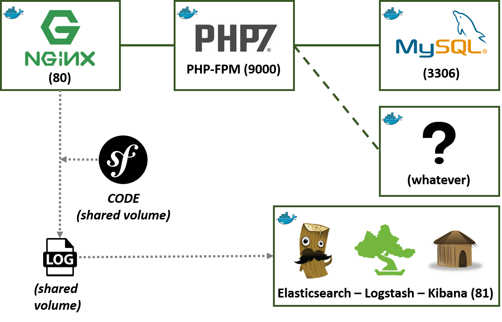

# Docker Symfony (PHP7-FPM - NGINX - MySQL)



Docker-symfony gives you everything you need for developing Symfony application. This complete stack run with docker and [docker-compose (1.7 or higher)](https://docs.docker.com/compose/).

## Installation

1. Create a `.env` from the `.env.dist` file. Adapt it according to your symfony application

    ```bash
    cp .env.dist .env
    ```


2. Build/run containers with (with and without detached mode)

    ```bash
    $ docker-compose build
    $ docker-compose up -d
    ```

4. Prepare Symfony app
    1. Update .env file

        ```bash
        # path/to/your/symfony-project/.env
        DATABASE_URL=mysql://db_user:db_password@db:3306/db_name
        ```

    2. Composer install & create database

        ```bash
        $ docker-compose exec php bash
        $ composer install
        # Symfony3
        $ php bin/console doctrine:database:create
        $ php bin/console doctrine:schema:update --force
        ```

5. Enjoy :-)

## Usage

Just run `docker-compose up -d`, then:

* Symfony app: visit [localhost](http://localhost)  
* Logs (files location): logs/nginx and logs/symfony

## Customize

If you want to add optionnals containers like Redis, PHPMyAdmin... take a look on [doc/custom.md](doc/custom.md).

## How it works?

Have a look at the `docker-compose.yml` file, here are the `docker-compose` built images:

* `db`: This is the MySQL database container,
* `php`: This is the PHP-FPM container in which the application volume is mounted,
* `nginx`: This is the Nginx webserver container in which application volume is mounted too,

This results in the following running containers:

```bash
$ docker-compose ps
           Name                          Command               State              Ports            
--------------------------------------------------------------------------------------------------
dockersymfony_db_1            /entrypoint.sh mysqld            Up      0.0.0.0:3306->3306/tcp      
dockersymfony_nginx_1         nginx                            Up      443/tcp, 0.0.0.0:80->80/tcp
dockersymfony_php_1           php-fpm                          Up      0.0.0.0:9000->9000/tcp      
```

## Useful commands

```bash
# bash commands
$ docker-compose exec php bash

# Composer (e.g. composer update)
$ docker-compose exec php composer update

# SF commands (Tips: there is an alias inside php container)
$ docker-compose exec php php /var/www/symfony/app/console cache:clear # Symfony2
$ docker-compose exec php php /var/www/symfony/bin/console cache:clear # Symfony3
# Same command by using alias
$ docker-compose exec php bash
$ sf cache:clear

# Retrieve an IP Address (here for the nginx container)
$ docker inspect --format '{{ .NetworkSettings.Networks.dockersymfony_default.IPAddress }}' $(docker ps -f name=nginx -q)
$ docker inspect $(docker ps -f name=nginx -q) | grep IPAddress

# MySQL commands
$ docker-compose exec db mysql -uroot -p"root"

# F***ing cache/logs folder
$ sudo chmod -R 777 app/cache app/logs # Symfony2
$ sudo chmod -R 777 var/cache var/logs var/sessions # Symfony3

# Check CPU consumption
$ docker stats $(docker inspect -f "{{ .Name }}" $(docker ps -q))

# Delete all containers
$ docker rm $(docker ps -aq)

# Delete all images
$ docker rmi $(docker images -q)
```
